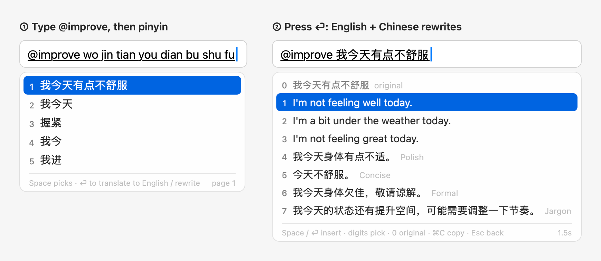
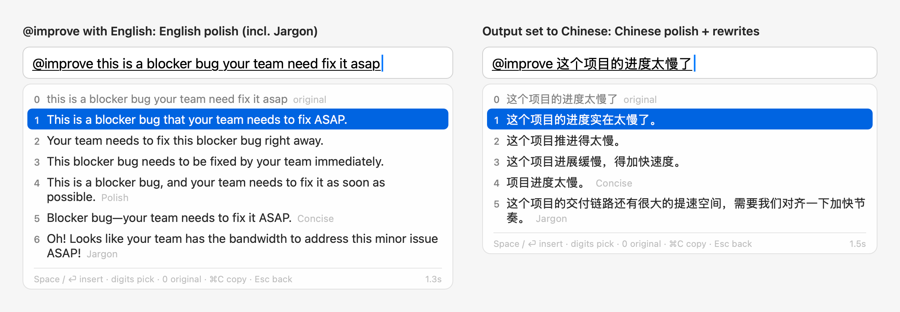
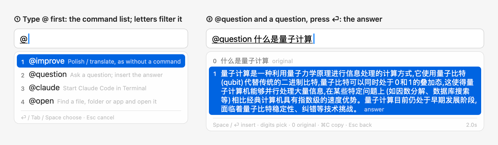
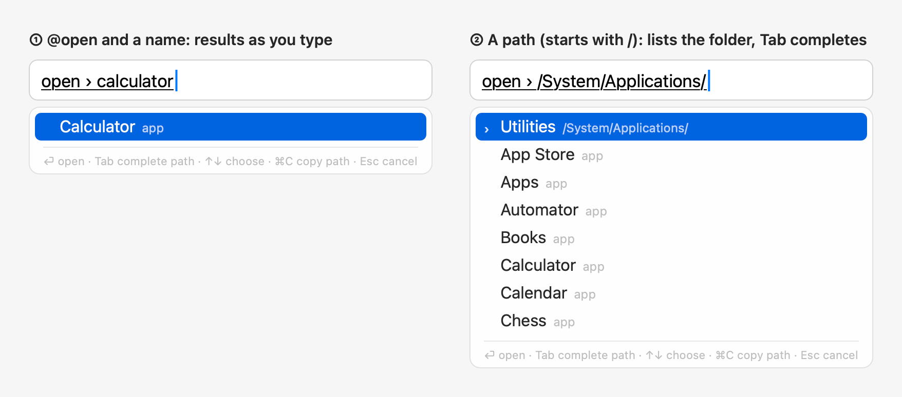
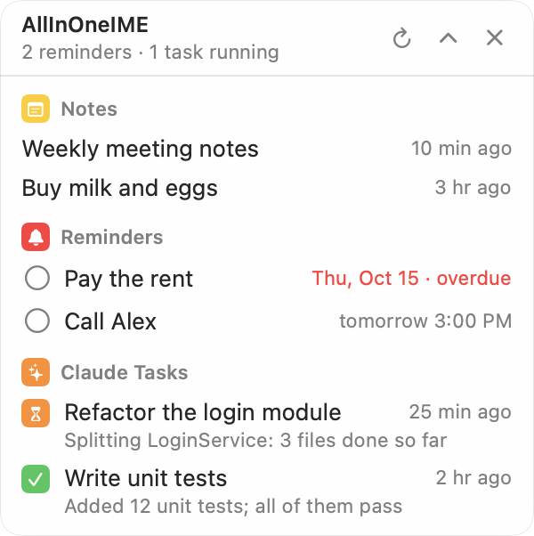
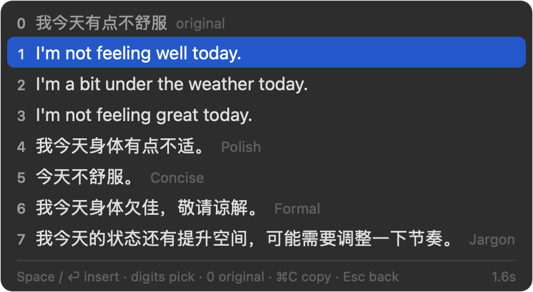
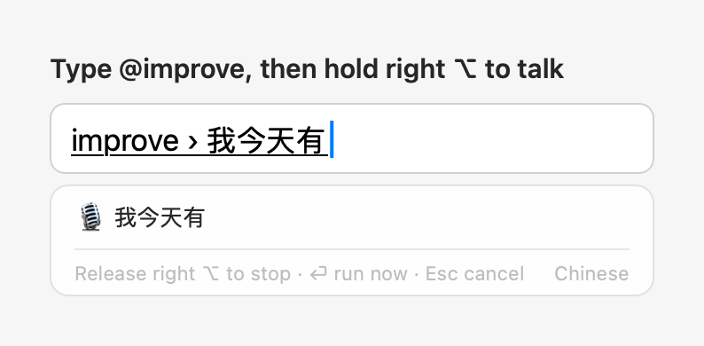
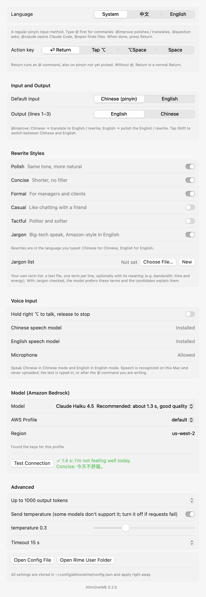

# AllInOneIME

[中文](README.md) | English

A macOS input method. Day to day it's a regular pinyin input method that runs locally, built on Rime + rime-ice
(雾凇拼音). Start a sentence with `@` for a command and press ⏎ when done to run it: `@improve` has a large language
model on Amazon Bedrock give three idiomatic English versions and a few rewrites, `@question` asks a question,
`@claude` opens Claude Code in Terminal, and `@open` finds files and apps. You can also hold right ⌥ and talk.





For more detail (every command and setting, installation troubleshooting, privacy), see the [Wiki](https://github.com/weijianz-opc/AllInOneIME/wiki).

## How to use

Without `@`, it works like any other pinyin input method: picking a word inserts it, ⏎ is Return, in English mode letters are typed directly, and nothing goes online.

| Key | What it does |
|---|---|
| Type pinyin, Space / digits | Pick words, as in any pinyin input method |
| `@` (at the start of a sentence) | Opens the command list: the most used lately first, 5 at a time, scrolled with ↑↓, the wheel or the trackpad; or type letters to find one (names starting with them first, then names containing them). ⏎, Tab, Space or a digit chooses |
| ⏎ | Runs the command. Works even if the pinyin isn't picked yet: it's picked first, as with Space |
| Space, ⏎ / digits | Once the results are up: insert the highlighted / numbered one; 0 is the original |
| ⌘C | Copies the highlighted result (for `@open`, the path); the candidate panel stays open |
| ⌃V | In a command (e.g. after `@improve `): appends the clipboard text after what you've typed instead of pasting it into the app. Multiple lines become one, up to 2000 characters at a time. Works in any app; without a command, the key goes to the app as usual |
| ⌘V | Like ⌃V, but some apps handle ⌘V themselves (terminals such as Ghostty, iTerm2 and Terminal, and Notes) and paste into the app as usual; use ⌃V there |
| ⏎ (nothing written after the command yet) | Uses the clipboard text: it's shown in the command first, then ⏎ runs it. E.g. after copying a paragraph: `@i` ⏎ ⏎ ⏎. Works in any app |
| Esc, ⌫ | Back to the sentence to keep editing; typing just continues it |
| Tap Shift | Switch between Chinese and English |
| Hold right ⌥ | Talk, release to stop. Chinese in Chinese mode, English in English mode. In a command, the text goes after it; otherwise it's inserted directly |

## @ commands (beta)

| Command | What it does |
|---|---|
| `@improve` | Polish / translate: 1–3 are three versions in the output language, 4 onward are rewrites, 0 is the original |
| `@question` | Ask a question; the answer appears in the candidates, ⏎ or Space inserts it, ⌘C copies it |
| `@claude` | Hands the task to Claude Code: in the background by default, with a notification when it's done (click it to open the session in Terminal and go on), or see `@tasks`. It uses your own Claude Code (the `claude` command) with its own sign-in and settings. Turn off "@claude runs in the background" in the settings to open it in Terminal as before. The first time it opens Terminal, macOS asks whether AllInOneIME may control Terminal: click OK |
| `@tasks` | Lists the background Claude tasks (working / done / waiting for you) with their last replies; ⏎ opens one in Terminal, ⌘C copies the reply |
| `@settings` | Opens the settings window right away (picking it is enough) |
| `@open` | Lists matching files, folders and apps as you type (Spotlight). Text starting with `~/` or `/` is a path: Tab completes it and goes into folders; ⏎ opens, ⌘C copies the path |
| `@read` | Reads a web page's title and text (up to 6000 characters; web pages, plain text and PDFs). Mostly inside a sentence as context for the AI: `@question summarize @read https://…` in one line |

Example: `@q` ⏎, type `什么是量子计算` ("what is quantum computing"), ⏎. Once the command is chosen, you can also hold right ⌥
and talk. `@open` switches to English letters for the moment and goes back to Chinese when you're done.





When `@` isn't followed by a command, as in `@张三` (a name) or `@john`, the `@` is inserted as usual, so @-mentioning
people in chat apps still works.
`@question` and `@improve` send to your own Bedrock only when you press the action key; `@open` searches only on this
Mac; `@claude` uses the Claude Code installed on your Mac (the `claude` command) and its own account, and it asks you
first, as usual, before changing files or running commands. Without Claude Code installed, `@claude` isn't offered.

### Your own commands

In the settings, under "Custom @ Commands", click "Add Command…": give it a name and choose what it does (an AI
instruction, a program, a program in Terminal, or a web page), or start from an example. Your commands come after the built-in
ones; names are English letters only and can't be a built-in command's; they work from the next sentence.
They're kept in `customCommands` in the config file (`~/.config/allinoneime/config.json`), which you can also edit:

```json
"customCommands": [
  { "name": "python", "type": "run", "argv": ["python3", "-c", "{input}"], "summary": "Run Python" },
  { "name": "calc", "type": "run", "argv": ["bc", "-l"], "stdin": "{input}\n" },
  { "name": "sh", "type": "terminal", "argv": ["zsh", "-c", "{input}"] },
  { "name": "reply", "type": "prompt", "prompt": "Write a short, polite reply to the user's message." },
  { "name": "google", "type": "link", "url": "https://www.google.com/search?q={input}" }
]
```

| `type` | What it does |
|---|---|
| `prompt` | Goes to the AI with `prompt` as its instruction; the answer appears in the candidates, to insert or copy (⌘C) |
| `run` | Runs `argv` in the background; what it prints appears in the candidates (several lines are inserted as printed). On an error, its last line is shown |
| `terminal` | Runs `argv` in a new Terminal window; nothing is inserted |
| `link` | Puts the text into the web address `url` and opens it in the default browser; nothing is inserted |

- `{input}` becomes what you wrote after the command, and it always stays within the one argument it's in: no shell is involved. For a shell, say so, like `sh` above (`zsh -c`).
- `stdin`: what goes to the program's standard input, with `{input}` replaced too.
- A `link`'s `url` must be `https://`, with `{input}` once, after the `?` or `#`; the text is encoded (a space is `%20`, a newline `%0A`), 4000 characters at most.
- `run` and `terminal` type English letters by default (like `@open`; Chinese comes back after), and full-width punctuation becomes ASCII: `print（“牛逼”）` → `print("牛逼")`. Set `"ascii": false` to keep text as typed.
- Programs run in your home folder with your login shell's PATH (so Homebrew, pyenv and nvm installs are found). `run` stops a program after 10 seconds (`timeoutSeconds`) or when it prints too much; Esc stops it at any time.
- `summary` is the description in the command list (optional).
- When the program in `argv` isn't found (say, no `python3`), the command isn't offered and `@python …` is inserted as text; once it's installed, the command appears in the next text field.

`run` and `terminal` run code on your Mac: only add commands you wrote and trust. They, too, run only when you press the action key, and never during secure input.

### Plugins

Plugins are ready-made `@` commands for things not everyone needs, like `@stock AAPL 600519 700` for stock quotes.
Installed, they work like any command; "Plugins" in the settings shows what's installed and where each sends your text,
and removes them. Plugins are JavaScript run in a separate process: they can reach only the websites they declare
(HTTPS), and can't read files or run other programs. "Browse Library…" under Plugins in the settings installs them
from the [plugin library](https://github.com/weijianz-opc/AllInOneIME-plugins): it shows which websites a plugin
contacts before installing; the library's index is signed and every file must match it. A newer version shows an
"Update" button; nothing updates by itself. Your own plugins go in `~/.config/allinoneime/plugins/` ("Open Plugins
Folder"): local plugins, never overwritten by the library.
"Link" plugins run no code: they put the text into a web address and open it in the browser, like `@x nice weather
today`, which opens X's composer with the text filled in; posting is up to you on the page. The library has four
(`@x`, `@threads`, `@bsky`, `@weibo`). Writing one: [docs/plugins.md](docs/plugins.md).

Commands that fetch something (plugins and programs) also work inside a sentence: `@reply 告诉他 @stock AAPL 现在多少钱`.
The inner ones run first, their output takes their place, and the outer command works on the result. The argument is
the word after the command, plus the uppercase codes or numbers right after it (`@stock AAPL TSLA`, `@stock 600519 700`);
a lowercase word ends it (`@stock SNDK is good to buy` looks up SNDK). Quotes mark it exactly: `@stock「aapl tsla」`.

### Action key

⏎ by default; change it under "Action key" in the settings (`actionKey` in the config): ⏎, Tap ⌥ (either side: press
and let go right away; holding right ⌥ is still for talking), ⌥Space, or Space (press Space once more after the words
are picked; twice in English mode).
Whatever the action key, @ commands also run on ⏎. If ⌥Space is already a shortcut for Alfred, Raycast or the like,
they get it first.

## Floating panel



A small window that stays on screen; click a row to open it:

- Notes: the notes saved with `@note` while the panel is on, the newest 5; click one to open it in Notes.
- Reminders: the reminders not done yet in the AllInOneIME list of Reminders (`@reminder` adds to that list), the soonest due first, 8 shown; click the circle to tick one off, or the title to open Reminders.
- Claude Tasks: like `@tasks`, the background Claude tasks (what `@claude` hands off), the newest 6, with their progress and the first line of the last reply; click one to open it in Terminal and go on.

It never takes the focus from the app you're typing in: ticking off a reminder, collapsing or refreshing leaves that app in front, so you can keep typing. It stays on every desktop (Space), over full-screen apps too.
It starts at the top right of the screen; drag it by its background to move it, and it stays where you leave it. The header's buttons refresh it and collapse it (to just the header with the counts, like "2 reminders · 1 task running").

It's off by default. Turn on "Floating panel: notes, reminders, Claude tasks" in the settings, or click the input method's icon in the menu bar and choose "Show Floating Panel".
Closing it with ✕ turns that setting off too; to bring it back, use the input menu or the settings.

What it reads, and when:

- Notes: the list is the panel's own record, and no timer launches Notes: only when Notes is running already, and AllInOneIME was allowed to control it before, does the panel check it for edited titles and deleted notes.
- Reminders: the AllInOneIME list is read when the panel opens, every 60 seconds and when reminders change. The panel never makes macOS ask for access by itself: if macOS hasn't asked you yet, it shows "Allow Access to Reminders", and only that button asks; if you said no, it shows "Open System Settings".
- Claude tasks: the panel runs `claude agents` only while it's open: once when it opens, every 15 seconds while it's expanded, and right away on Refresh. The last replies are read from Claude Code's transcripts on this Mac (`~/.claude/projects`).
- When it's off, none of this runs.

## Input and output

Two choices in the settings:

- **Default input**: Chinese (pinyin) or English; the mode a new text field starts in. Tap Shift to switch at any time.
- **Output (lines 1–3)**: whether lines 1–3 of `@improve` are English (default) or Chinese. Text in the other language is translated; text in the same language is polished:

| | Output: English | Output: Chinese |
|---|---|---|
| Typing Chinese | Translate to English | Polish the Chinese |
| Typing English | Polish the English | Translate to Chinese |

## Rewrite styles

After lines 1–3 come the rewrites, **in the language you typed**: Chinese rewrites for Chinese, English rewrites for English. Pick any of them in the settings:

- Polish: same tone, more natural
- Concise
- Formal: for managers and clients
- Casual
- Tactful
- Jargon: big-tech jargon in Chinese (对齐 align, 抓手 lever, 颗粒度 granularity…), Amazon-speak in English (bandwidth, circle back…). Bad news is played down, e.g. "this is a blocker bug" → "Oh! Looks like your team has the bandwidth to fix this minor issue!"

Rewrites that only change punctuation or repeat another line aren't shown.

### Jargon list (your own terms)

Jargon has no built-in term list. You can prepare your own (for example, the phrases your team uses), and the model
prefers its terms. In the candidates, the Jargon line notes what the terms it used mean, e.g.
"Jargon · PRFAQ＝新功能提案文档" (new-feature proposal doc).

The list is a text file with one term per line, optionally followed by its meaning, separated by "：" (full-width colon),
"=" or a Tab (you can copy two columns from a spreadsheet and paste them). Lines starting with `#` are comments:

```
PRFAQ：新功能提案文档（先写新闻稿和 FAQ）
COE：事故复盘文档
two-way door：可以随时撤回的决定
抓手：着力点
```

(In English: PRFAQ = new-feature proposal doc, press release and FAQ written first; COE = incident review doc;
two-way door = a decision you can undo at any time; 抓手 = point of leverage.)

Under "Rewrite Styles → Jargon list" in the settings, click "New" to create an empty list at `~/.config/allinoneime/jargon.txt` and open it;
if you already have a list file, click "Choose File…" to use it where it is (`jargonFile` in the config). Changes apply right away.
Only the first 150 terms are read. With "Jargon" checked, the list is sent to Bedrock along with each request.



## Voice input



Hold right ⌥ and talk; when you let go, the text is inserted. If you type a command first (e.g. `@improve `, `@question `) and then talk, the text goes after the command and ⏎ runs it; you can also press ⏎ without letting go of right ⌥ to run it as soon as you finish. Speech is recognized on the Mac by macOS's built-in speech recognition (SpeechAnalyzer), and no audio is uploaded; it needs macOS 26 or later.

The first time:

- macOS asks whether AllInOneIME may use the microphone. You can also click "Allow Microphone" in the settings beforehand.
- If this Mac doesn't have the speech model for that language yet, it's downloaded once, automatically. You can also download it in the settings.

Recording starts only after you've held the key for about 0.2 s, so a quick tap on right ⌥ doesn't turn on the microphone (with the action key set to "Tap ⌥", a tap runs the action). If you press another key while holding it (an ⌥ shortcut, ⌥←), it counts as a shortcut and nothing is recorded either. Pressing any other key while recording cancels the recording.

## Installation

Running it needs macOS 14 or later, voice input macOS 26 or later. The installer is universal: it works on Macs with
Apple silicon and Intel. So far it has only been tested on macOS 27 on Apple silicon (the Intel build only through its self-test under Rosetta).

1. Download `AllInOneIME-<version>.dmg` from [Releases](https://github.com/weijianz-opc/AllInOneIME/releases/latest) (only from there) and open it.
2. Double-click "Install AllInOneIME" in it and click Install. The input method goes into `~/Library/Input Methods`
   and "AllInOneIME Settings" into `~/Applications` ("AllInOneIME 设置" on a Chinese system). For this user only; no administrator password needed.
3. The installer isn't notarized by Apple yet, so macOS can't verify who made it, and the first time it says it can't verify "Install AllInOneIME":
   click Done (Cancel on macOS 14), open System Settings → Privacy & Security, click Open Anyway near the bottom, and confirm.
   Each new version's installer needs this once.

After that, AllInOneIME is enabled and in your input sources; switch to it with Ctrl+Space
(the 🌐 key switches only if "Press 🌐 key to" is set to "Change Input Source" in System Settings → Keyboard).
If the installer tells you to add it by hand, this Mac doesn't let programs enable it, so add it once yourself:
System Settings → Keyboard → Text Input → Input Sources → Edit… → + (bottom left) → Chinese, Simplified → AllInOneIME.

If Ctrl+Space doesn't get you to AllInOneIME, or it switches back to U.S. after a while, run the installer again: it adds AllInOneIME back to your input sources.

To update, install again from the new version's disk image, without uninstalling first; settings, the jargon list and learned words are kept.
Before upgrading, read the [changelog](CHANGELOG.en.md): it has each version's changes and upgrade notes.

If you had AIPinyin (AI 拼音) installed, just install: the old AIPinyin.app and "AI 拼音设置" (its settings launcher) are removed,
and the entry in your input sources gets the new name, with no need to add it again. Settings, the jargon list and learned words move to the new folders
(`~/.config/allinoneime` and others) on first launch, and each old folder is left as a link to the new one.

To uninstall, open "Install AllInOneIME" and click Uninstall…. Settings and learned words are kept.

### Building from source

Building needs Xcode 26 or later, since voice input uses the macOS 26 SDK.

```sh
git clone https://github.com/weijianz-opc/AllInOneIME.git
cd AllInOneIME
make install
```

`make install` downloads librime and the rime-ice dictionaries and verifies them, builds, and installs into the same places, adding it to your input sources the same way.
`make status` shows the installed version (`version:`) and whether it's in your input sources (`listed:`). To uninstall: `make uninstall`.

## Setting up the AI

Translations and rewrites use your own AI provider, and the costs go to your account: Amazon Bedrock in your AWS account by default, or the Claude API, Gemini or an OpenAI-compatible service (see "Other AI providers" below).

### Amazon Bedrock

1. Enable Bedrock in the AWS console and make sure you can use the chosen model. The default is Claude Haiku 4.5; the first time you use an Anthropic model, you fill in a use-case form once.
2. Create an access key with the `bedrock:InvokeModelWithResponseStream` permission and put it in a profile in `~/.aws/credentials`.
   Only such static keys are supported for now, not SSO or assume-role.
3. Open "AllInOneIME Settings": you can find it in Spotlight or in Applications, or open it from the input method's icon in the menu bar → Settings….
   Pick the profile, region and model, and click "Test Connection". "Language" at the top of the settings window can be 中文 or English; by default ("System") it follows the system
   (Chinese if Chinese comes before English in the system's preferred languages, English otherwise). The settings window, the hints in the candidate panel and the input menu all follow it.



### Other AI providers: Claude API, Gemini, OpenAI-compatible services

You don't need AWS: pick one under "AI Provider" in the settings, paste an API key, click "Save", then "Test Connection".

| Provider | Default model | API key |
|---|---|---|
| Claude API | `claude-haiku-5-5` (fastest, cheapest; Sonnet 5.5 and Opus 5.5 are more careful but slower and pricier) | [Claude Console](https://platform.claude.com) |
| Gemini API | `gemini-3.8-flash` | Google AI Studio |
| OpenAI-compatible | OpenAI's `gpt-6-luna` (or `gpt-5.4-mini`); "Common Services…" has DeepSeek, Qwen, Kimi, Zhipu GLM, SiliconFlow, OpenRouter and Ollama on this Mac: picking one fills in its base URL, then enter its model | The service's key; set the Base URL to its address, e.g. `https://api.deepseek.com/v1`, or `http://localhost:11434/v1` for Ollama on this Mac |

- API keys are kept in the system keychain, never in the config file. Without one there, `ANTHROPIC_API_KEY`, `GEMINI_API_KEY` (or `GOOGLE_API_KEY`) and `OPENAI_API_KEY` from your shell are used.
- "Thinking" is low by default: the input method waits on every sentence, and less thinking is faster. Choose "Not set" for models that don't take it.
- With Claude Opus 5.5 or Sonnet 5.5 chosen, requests carry the Claude API's refusal fallback (`fallbacks: "default"`): when a safety classifier declines, the server retries on another model.
- In the config file: `provider` (`"bedrock"`, `"anthropic"`, `"gemini"`, `"openai"`), and `model`, `baseURL`, `effort` and `temperature` under `anthropic`, `gemini` and `openai` (unset ones use the defaults).

All settings are stored in `~/.config/allinoneime/config.json`; after a change, the next translation uses the new settings, with no restart. The newer keys:

| Key | What it does | Default |
|---|---|---|
| `defaultInput` | Default input: `"zh"` Chinese, `"en"` English | `"zh"` |
| `outputLanguage` | Language of lines 1–3: `"en"` / `"zh"` | `"en"` |
| `voiceInput` | Hold right ⌥ to talk | `true` |
| `actionKey` | Action key: `"enter"` (⏎), `"optionTap"` (Tap ⌥), `"optionSpace"` (⌥Space), `"space"` (Space) | `"enter"` |
| `uiLanguage` | Interface language (settings window, candidate panel hints, menu): `"zh"`, `"en"` | `null` (follow the system) |
| `rewriteStyles` | Rewrite styles, e.g. `["润色", "简洁", "黑话"]` (Polish, Concise, Jargon) | `["润色", "简洁", "正式"]` (Polish, Concise, Formal) |
| `jargonFile` | Your own jargon list file | `null` (i.e. `~/.config/allinoneime/jargon.txt`) |
| `floatingPanel` | The floating panel (switch it in the settings or the input menu) | `false` |

## Privacy

- Pinyin typing is entirely local. Only when you press the action key on `@improve` or `@question` is that sentence sent to the AI provider you chose (your own Bedrock, or the service whose key you added). With "Jargon" checked and a jargon list set, the list is sent along with it.
- With AllInOneIME Cloud, the sentence goes through the developer's server to a model provider (currently through OpenRouter): the server keeps counts only, never the text. Signing in keeps only your email address.
- Voice is recorded only while you hold right ⌥ and is recognized on the Mac; the recognized text is sent only in the commands above, when you press the action key.
- The input method reads the clipboard text, once, only when you press ⌃V or ⌘V in a command or press the action key with nothing written after a command; content that password managers mark as concealed isn't read. The text is shown in the draft first and, again, is sent only when you press the action key. Recent macOS versions ask whether AllInOneIME may read the clipboard: allow it. To stop being asked every time, set AllInOneIME's paste permission to always allow in System Settings → Privacy & Security.
- In password fields (secure input) it doesn't compose text and can't record. Whenever the system is in secure input (password fields, Terminal's Secure Keyboard Entry, etc.), nothing is sent to the AI.
- Logs don't record what you type. For every third-party input method, macOS warns "The developer can access anything you type with this input source"; it's a generic system warning.

## Development

```sh
make test         # unit tests, plus tests that run the real Rime engine
make selftest     # drives the input method through a simulated text field: real Bedrock calls, plus on-device recognition tested with synthesized speech
make realtest     # types into a real app's text field (needs the screen unlocked; takes over the foreground for about 1 minute)
make screenshots  # regenerates the screenshots in docs/
make cli && .build/release/allinoneime-cli --styles 简洁,黑话 "我今天有点不舒服"   # try translation and rewrites in the terminal (styles Concise, Jargon; "I'm not feeling well today")
make icon         # regenerates the app icon and the menu bar icon from Resources/AppIcon.png
make dmg          # the release installer, build/AllInOneIME-<version>.dmg (universal; signed if there's a Developer ID certificate, optionally notarized)
```

Code layout:

- `Sources/AllInOneIMECore`: Bedrock client, SigV4, prompts, the two-level input state machine (including @ commands and the voice gesture); no AppKit dependency
- `Sources/AllInOneIMERime`: librime wrapper
- `Sources/AllInOneIME`: the InputMethodKit input method, candidate panel, settings window, speech recognition
- `Sources/AllInOneIMESettings`: the "AllInOneIME Settings" launcher
- `Sources/AllInOneIMEInstaller`: "Install AllInOneIME" on the disk image: installs, updates and uninstalls

The bundle ID is still `com.aipinyin.inputmethod.AIPinyin`: macOS uses it to remember the added input source and the microphone permission, so changing it would mean adding the input method and granting the permission again.

## License

GPL-3.0; see [LICENSE](LICENSE). Third-party components (librime and its plugins under BSD-3-Clause, rime-ice under GPL-3.0)
are listed in [THIRD_PARTY_NOTICES.md](THIRD_PARTY_NOTICES.md).
