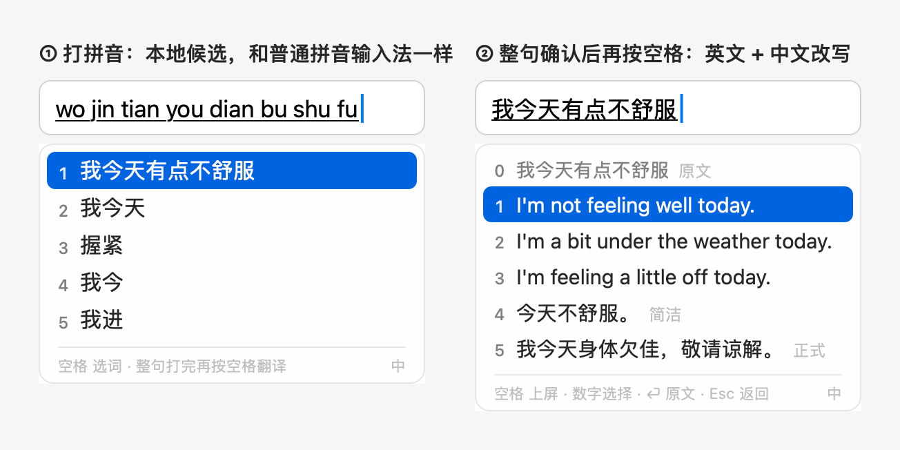
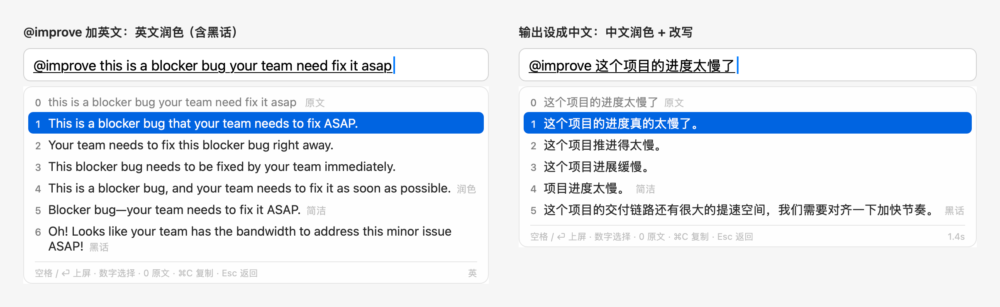
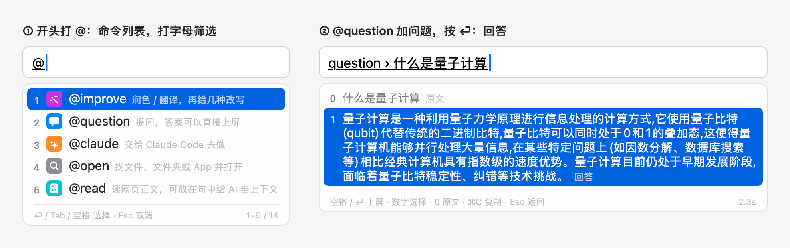
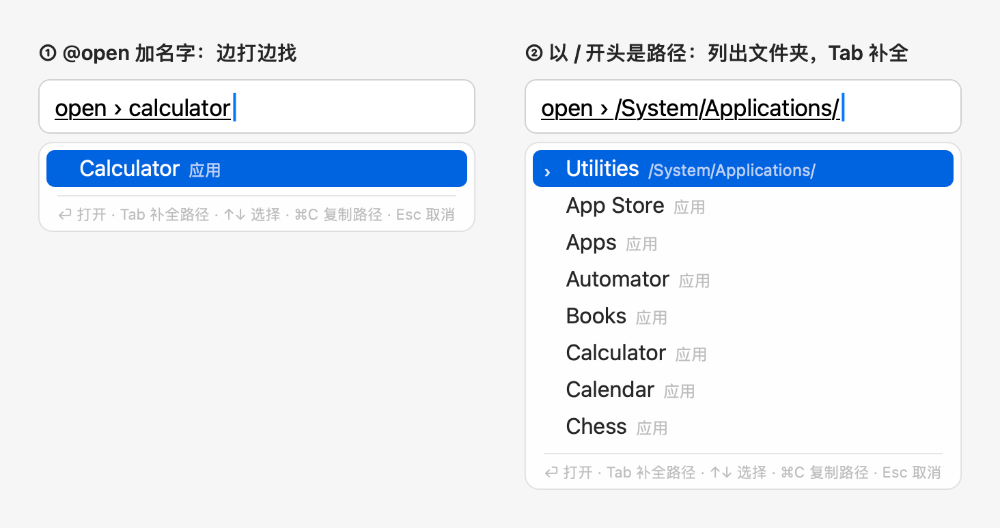
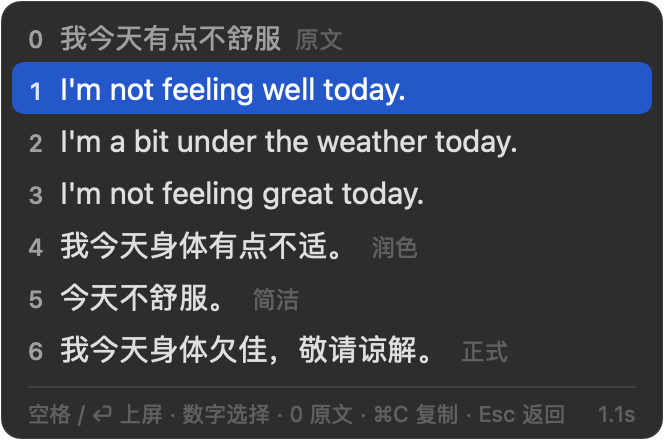
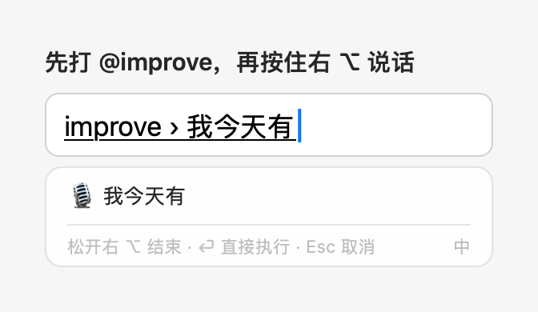
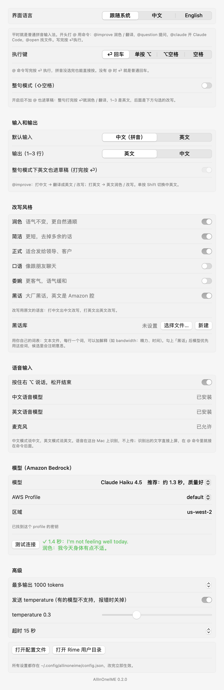

# AllInOneIME

中文 | [English](README.en.md)

一个 macOS 输入法。平时就是普通拼音输入法，在本地运行，基于 Rime + 雾凇拼音。句子开头打 `@` 就是命令，
写完按 ⏎ 执行：`@improve` 用 Amazon Bedrock 上的大模型给出三种地道的英文说法和几种改写，`@question` 提问，
`@claude` 在终端里开 Claude Code，`@open` 找文件和 App。也可以按住右 ⌥ 说话。





更详细的说明（每个命令和设置、安装排查、隐私）见 [Wiki](https://github.com/weijianz-opc/AllInOneIME/wiki)。

## 怎么用

不打 `@` 的时候，它和别的拼音输入法一样：选词直接上屏，⏎ 就是回车，英文模式下字母直接上屏，不联网。

| 按键 | 作用 |
|---|---|
| 打拼音、空格 / 数字 | 选词，和普通拼音输入法一样 |
| `@`（句子开头） | 弹出命令列表：最近常用的在前，一次显示 5 个，↑↓、滚轮或触控板往下滚；也可以打字母找（名字开头的优先，也找名字里含这些字母的）。⏎、Tab、空格或数字选中 |
| ⏎ | 执行命令。拼音没选完也可以直接按，会先像按空格一样选完 |
| 空格、⏎ / 数字 | 出结果后：上屏高亮项 / 对应项，0 是原文 |
| ⌘C | 复制高亮的结果（`@open` 是复制路径），候选框不关 |
| ⌃V | 在命令里（比如 `@improve ` 后面，或整句模式的草稿里）：把剪贴板里的文字接到已经打的字后面，不贴进 App。多行合成一行，一次最多 2000 字。哪个 App 里都能用；没有命令时照常交给 App |
| ⌘V | 和 ⌃V 一样，但有的 App 会自己处理 ⌘V（终端如 Ghostty、iTerm2、Terminal，还有备忘录），在那里会照常粘贴进 App，请用 ⌃V |
| ⏎（命令后面还没写内容） | 用剪贴板里的文字：先显示在命令里，再按 ⏎ 执行。比如复制一段话后 `@i` ⏎ ⏎ ⏎。哪个 App 里都能用 |
| Esc、⌫ | 回到这句话继续修改；直接打字就是接着往后写 |
| 单按 Shift | 切换中英文 |
| 按住右 ⌥ | 说话，松开结束。中文模式说中文，英文模式说英文。在命令里就接在后面，否则直接上屏 |
| ⇧空格 | 开关整句模式（见下） |

## @ 命令（试用）

| 命令 | 作用 |
|---|---|
| `@improve` | 润色 / 翻译：1–3 是输出语言的三种说法，4 起是改写，0 是原文 |
| `@question` | 提问，答案出现在候选里，⏎ 或空格上屏，⌘C 复制 |
| `@tasks` | 列出后台的 Claude 任务（进行中 / 完成 / 等你确认）和它们最后的回复；⏎ 在终端打开接着聊，⌘C 复制回复 |
| `@settings` | 直接打开设置窗口（选中就打开，不用再写内容） |
| `@claude` | 交给 Claude Code：默认在后台做，做完弹系统通知（点通知在终端里打开这个会话接着聊），也可以用 `@tasks` 查看。用的是你本机的 Claude Code（`claude` 命令）和它自己的登录、设置。设置里关掉「@claude 在后台运行」就像以前一样在终端打开。第一次打开终端时 macOS 会问是否允许控制「终端」，点「好」 |
| `@open` | 边打边列出匹配的文件、文件夹和 App（聚焦搜索）。以 `~/`、`/` 开头就是路径，Tab 补全，进文件夹；⏎ 打开，⌘C 复制路径 |
| `@read` | 读网页的标题和正文（最多 6000 字，网页、纯文本、PDF 都行）。主要放在句子中间给 AI 当上下文：`@question 用一句话总结 @read https://…` |
| `@imessage` | 发 iMessage：先打名字、拼音（全拼或首字母，如 `zs`）、手机号或邮箱，在候选框里选收件人（最近发过的排前面；也可以直接打完整的手机号或邮箱），再写消息（句中的 `@stock AAPL` 这类命令会先运行）。⏎ 在候选框里显示「发给 张三（…）：消息」，再按 ⏎ 才发出，Esc 回去修改；不会往输入框里写任何东西。第一次用时 macOS 会问能否访问通讯录、能否控制「信息」，都点「好」 |

例：`@q` ⏎，打 `什么是量子计算`，⏎。选好命令后按住右 ⌥ 说话也行。`@open` 会临时切到英文字母，用完回到中文。





`@` 后面跟的不是命令时，比如 `@张三`、`@john`，`@` 照常上屏，在聊天软件里 @ 人不受影响。
`@question` 和 `@improve` 只在按执行键时发到你自己的 Bedrock；`@open` 只在本机搜索；`@claude` 用的是你本机装的
Claude Code（`claude` 命令）和它自己的账号，改文件、跑命令前它会照常先问你；没装 Claude Code 时不显示
`@claude`。`@imessage` 只在本机读通讯录（姓名、电话、邮箱），不经过 AI，由「信息」发出；没有「信息」App 时不显示。

### 自己加命令

在设置的「自定义 @ 命令」里点「添加命令…」：起个名字，选它做什么（AI 指令、运行程序、在终端运行、打开网页），也可以从例子开始。
命令排在内置命令后面，名字只能用英文字母，不能和内置命令重名；保存后下一句就能用。
它们存在配置文件（`~/.config/allinoneime/config.json`）的 `customCommands` 里，也可以直接改：

```json
"customCommands": [
  { "name": "python", "type": "run", "argv": ["python3", "-c", "{input}"], "summary": "运行 Python" },
  { "name": "calc", "type": "run", "argv": ["bc", "-l"], "stdin": "{input}\n" },
  { "name": "sh", "type": "terminal", "argv": ["zsh", "-c", "{input}"] },
  { "name": "reply", "type": "prompt", "prompt": "Write a short, polite reply to the user's message." },
  { "name": "google", "type": "link", "url": "https://www.google.com/search?q={input}" }
]
```

| `type` | 做什么 |
|---|---|
| `prompt` | 发给 AI，`prompt` 是给它的指令；回答出现在候选里，可以上屏或 ⌘C 复制 |
| `run` | 在后台运行 `argv`，打印的内容出现在候选里（多行照原样上屏）；出错时显示错误的最后一行 |
| `terminal` | 在新的终端窗口里运行 `argv`，不上屏 |
| `link` | 把内容填进网址 `url`，在默认浏览器里打开，不上屏 |

- `{input}` 换成命令后面写的内容，而且永远只占它所在的那一个参数，不经过 shell。要用 shell 就像上面的 `sh` 那样明确写 `zsh -c`。
- `stdin`：给程序标准输入的内容，`{input}` 同样会被替换。
- `link` 的 `url` 必须是 `https://`，`{input}` 只能出现一次，而且要在 `?` 或 `#` 后面；内容会编码（空格是 `%20`，换行是 `%0A`），最多 4000 字。
- `run` 和 `terminal` 默认用英文字母输入（像 `@open`，用完回到中文），全角标点会转成半角：`print（“牛逼”）` → `print("牛逼")`。不想这样就设 `"ascii": false`。
- 程序在主目录里运行，用你的登录 shell 的 PATH（Homebrew、pyenv、nvm 装的都找得到）；`run` 默认 10 秒超时（`timeoutSeconds`），输出太多也会被停止，Esc 随时停止。
- `summary` 是命令列表里的说明，可以不写。
- 找不到 `argv` 里的程序时（比如没装 `python3`），这个命令不显示，`@python …` 照常当文字上屏；装好后切换一下输入框就会出现。

`run` 和 `terminal` 会在你的 Mac 上执行代码：只放你自己写的、信得过的命令；它们同样只在按执行键时运行，安全输入时不运行。

### 插件

插件是别人写好的 `@` 命令，不是人人都要的放在这里，比如 `@stock AAPL 600519 700` 查股价。
装好后和其他命令一样用；设置的「插件」里能看到装了哪些、它会把内容发到哪里，也能删除。
插件用 JavaScript 写，在单独的进程里运行：只能访问它声明的网站（HTTPS），读不到文件，也不能运行别的程序。
在设置的「插件」里点「浏览插件库…」，从[插件库](https://github.com/weijianz-opc/AllInOneIME-plugins)安装：
安装前会告诉你它会访问哪些网站；插件库的索引有签名，每个文件都要和索引核对上才装。有新版本时显示「更新」，手动点了才更新。
自己写的插件放进 `~/.config/allinoneime/plugins/`（设置里「打开插件文件夹」），算本地插件，插件库不会覆盖它。
也有不运行代码的「链接」插件：把内容填进网址，在浏览器里打开，比如 `@x 今天天气不错` 打开 X 的发帖框、文字已经填好，发不发由你在网页上决定。
插件库里有 `@x`、`@threads`、`@bsky`、`@weibo` 四个。
还有 `@xe` 换算汇率：`@xe 100 USD CNY`、`@xe 1000 日元 人民币`，一行结果带汇率日期（汇率来自 ExchangeRate-API）。
写插件的说明见 [docs/plugins.md](docs/plugins.md)。

查数据的命令（插件和「运行程序」）也可以写在句子中间：`@reply 告诉他 @stock AAPL 现在多少钱`。
里面的先运行，结果替换回原文，再交给外面的命令。参数是紧跟的一个代码，后面再跟着的大写代码或数字也算（`@stock AAPL TSLA`、`@stock 600519 700`）；
小写的普通单词会结束参数（`@stock SNDK is good to buy` 只查 SNDK）。要明确圈定就用「」或引号：`@stock「aapl tsla」`。

### 执行键

默认是 ⏎，可以在设置的「执行键」里换（config 里的 `actionKey`）：⏎、单按 ⌥（左右都行，按一下马上松开；
按住右 ⌥ 仍然是说话）、⌥空格，或者空格（词选完了再按一次空格，英文模式下连按两次）。
不管执行键是哪个，@ 命令都可以按 ⏎ 执行。⌥空格如果已经是 Alfred、Raycast 等的快捷键，会先被它们拿走。

### 整句模式

原来的用法：开启后不加 `@` 也进草稿，整句打完按执行键就润色 / 翻译，相当于每句都自动加了 `@improve`。
要原样上屏按 ⇧⏎（执行键不是 ⏎ 时就按 ⏎）。在设置里打开，或者按 ⇧空格（中文模式下）切换。默认关闭。

## 输入和输出

在设置里选两项：

- **默认输入**：中文（拼音）或英文，决定新的输入框从哪种模式开始。单按 Shift 随时切换。
- **输出（1–3 行）**：`@improve` 的 1–3 行用英文（默认）还是中文。原文是另一种语言就翻译，是同一种语言就润色：

| | 输出英文 | 输出中文 |
|---|---|---|
| 打中文 | 翻译成英文 | 中文润色 |
| 打英文 | 英文润色 | 翻译成中文 |

整句模式下英文也进草稿；不想这样的话，在设置里关掉「整句模式下英文也进草稿」。

## 改写风格

1–3 行之后是改写，**用原文的语言**：打中文出中文改写，打英文出英文改写。在设置里任选几种：

- 润色：语气不变，更自然
- 简洁
- 正式：发给领导、客户
- 口语
- 委婉
- 黑话：中文是大厂黑话（对齐、抓手、颗粒度…），英文是 Amazon 腔（bandwidth、circle back…）。坏消息会说得轻描淡写，比如 "this is a blocker bug" → "Oh! Looks like your team has the bandwidth to fix this minor issue!"

只改了标点、或者和其他行重复的改写不会显示。

### 黑话库（用你自己的词表）

黑话没有内置词库。你可以准备一个自己的词表（比如团队里常用的说法），模型会优先用里面的词。
候选里黑话那一行会注明用到的词是什么意思，例如「黑话 · PRFAQ＝新功能提案文档」。

词表是一个文本文件，每行一个词，后面可以加解释，用「：」「=」或 Tab 隔开（可以直接从表格复制两列粘贴）。
`#` 开头的行是注释：

```
PRFAQ：新功能提案文档（先写新闻稿和 FAQ）
COE：事故复盘文档
two-way door：可以随时撤回的决定
抓手：着力点
```

在设置的「改写风格 → 黑话库」里点「新建」，会在 `~/.config/allinoneime/jargon.txt` 建一个空词表并打开；
已经有词表文件的话，点「选择文件…」直接用它（config 里的 `jargonFile`）。改完马上生效。
最多读前 150 个词。勾上「黑话」时，词表会随请求一起发给 Bedrock。



## 语音输入



按住右 ⌥ 说话，松开后文字直接上屏。先打好命令（比如 `@improve `、`@question `）再说的话，文字接在命令后面，按 ⏎ 执行；也可以不松开右 ⌥ 直接按 ⏎，说完马上执行。语音用 macOS 自带的语音识别（SpeechAnalyzer）在本机完成，音频不上传；需要 macOS 26 或更新版本。

第一次使用时：

- macOS 会问是否允许 AllInOneIME 使用麦克风。也可以先在设置里点「允许使用麦克风」。
- 如果这台 Mac 还没有这种语言的语音模型，会自动下载一次。在设置里也可以手动下载。

按住约 0.2 秒后才开始录音，所以轻点右 ⌥ 不会打开麦克风（执行键设成「单按 ⌥」时，轻点就是执行）。按住时如果按了别的键（比如 ⌥ 组合键、⌥←），就当作快捷键，也不会录音。录音中按其他键会取消录音。

## 安装

运行需要 macOS 14 以上，语音输入要 macOS 26 以上。安装包是通用版，Apple 芯片和 Intel 的 Mac 都能用；
目前只在 macOS 27、Apple 芯片上测试过（Intel 版只在 Rosetta 下跑过自测）。

1. 从 [Releases](https://github.com/weijianz-opc/AllInOneIME/releases/latest) 下载 `AllInOneIME-<版本>.dmg`（只从这里下载），双击打开。
2. 双击里面的「安装 AllInOneIME」，点「安装」。输入法装到 `~/Library/Input Methods`，
   「AllInOneIME 设置」装到 `~/Applications`（英文系统里叫 AllInOneIME Settings）。只装给当前用户，不需要管理员密码。
3. 安装包还没有经过 Apple 公证，macOS 验证不了它是谁做的，第一次打开时会说无法验证「安装 AllInOneIME」：
   点「完成」（macOS 14 上是「取消」），打开 系统设置 → 隐私与安全性，在页面下方点「仍要打开」，再确认一次。
   每个新版本的安装程序都要这样放行一次。

装好后 AllInOneIME 已经启用，也在你的输入法列表里，用 Ctrl+空格 切换
（🌐 键要在 系统设置 → 键盘 里把「按下 🌐 键时」设成「更改输入法」才会切换）。
如果安装程序提示要手动添加，说明这台 Mac 不让程序启用，就自己加一次：
系统设置 → 键盘 → 文字输入 › 输入法「编辑…」→ 左下角 + → 简体中文 → AllInOneIME。

Ctrl+空格 切不到 AllInOneIME，或者切过去一会儿又变回 U.S.：再运行一次安装程序，它会把 AllInOneIME 加回输入法列表。

更新：用新版的 DMG 再装一次，不用先卸载，设置、黑话库和学到的词都保留。升级前看一下 [更新日志](CHANGELOG.md)，里面有每个版本的变化和升级须知。

以前装过 AI 拼音（AIPinyin）的话，直接安装就行：旧的 AIPinyin.app 和「AI 拼音设置」会被删掉，
输入法列表里那一项会换成新名字，不用重新添加。设置、黑话库和学到的词第一次启动时搬到新目录
（`~/.config/allinoneime` 等），旧目录留一个指向新目录的链接。

卸载：打开「安装 AllInOneIME」，点「卸载…」。设置和学到的词会保留。

### 从源码编译

编译需要 Xcode 26 以上，因为语音输入用到 macOS 26 SDK。

```sh
git clone https://github.com/weijianz-opc/AllInOneIME.git
cd AllInOneIME
make install
```

`make install` 会下载 librime 和雾凇拼音词库并校验，编译后装到同样的位置，同样加进输入法列表。
`make status` 显示装的是哪个版本（`version:`）、在不在输入法列表里（`listed:`）。卸载：`make uninstall`。

## 配置 AI

翻译和改写用你自己的 AI 服务，费用记在你的账号上：默认是 AWS 账号里的 Amazon Bedrock，也可以用 Claude API、Gemini 或兼容 OpenAI 的服务（见下面的「其他 AI 服务」）。

### Amazon Bedrock

1. 在 AWS 控制台开通 Bedrock，确认能用所选的模型。默认是 Claude Haiku 4.5，第一次用 Anthropic 模型要填一次用途说明。
2. 创建一个有 `bedrock:InvokeModelWithResponseStream` 权限的 access key，写进 `~/.aws/credentials` 里的一个 profile。
   目前只支持这种固定密钥，不支持 SSO 和 assume-role。
3. 打开「AllInOneIME 设置」，在聚焦搜索或「应用程序」里都能找到，也可以从菜单栏的输入法图标 → 设置… 打开。
   选好 profile、区域和模型，点「测试连接」。设置窗口最上面的「界面语言」可以选中文或 English；默认跟随系统
   （系统的首选语言里中文排在英文前面时显示中文，否则显示英文）。设置窗口、候选框里的提示和输入法菜单都跟着它。



### 其他 AI 服务：Claude API、Gemini、兼容 OpenAI 的服务

不用 AWS 也可以：在设置的「AI 服务」里选一个，粘贴 API key 点「保存」，再点「测试连接」。

| 服务 | 默认模型 | API key |
|---|---|---|
| Claude API | `claude-haiku-5-5`（最快最便宜；也可选 Sonnet 5.5、Opus 5.5，更用心但更慢更贵） | [Claude Console](https://platform.claude.com) |
| Gemini API | `gemini-3.8-flash` | Google AI Studio |
| 兼容 OpenAI 的服务 | OpenAI 的 `gpt-6-luna`（也可选 `gpt-5.4-mini`）；「常用服务…」里有 DeepSeek、通义千问、Kimi、智谱 GLM、硅基流动、OpenRouter、本机 Ollama，选了会填好 Base URL，再填它的模型 | 那个服务的 key；Base URL 填它的地址，比如 `https://api.deepseek.com/v1`，本机 Ollama 填 `http://localhost:11434/v1` |

- API key 存在系统钥匙串里，不写进配置文件。钥匙串里没有时，也会用 shell 里设的 `ANTHROPIC_API_KEY`、`GEMINI_API_KEY`（或 `GOOGLE_API_KEY`）、`OPENAI_API_KEY`。
- 「思考」默认是 low：输入法每句话都在等，思考越少越快。模型不支持这个参数时选「不设置」。
- 选 Claude Opus 5.5、Sonnet 5.5 时会带上 Claude API 的拒答兜底（`fallbacks: "default"`）：安全分类器拒绝时，服务端自动换一个模型重试。
- 配置文件里对应 `provider`（`"bedrock"`、`"anthropic"`、`"gemini"`、`"openai"`），以及 `anthropic`、`gemini`、`openai` 各自的 `model`、`baseURL`、`effort`、`temperature`（不填就用默认值）。

所有设置都存在 `~/.config/allinoneime/config.json`，改完后，下一次翻译就会用上新设置，不用重启。新加的几项：

| 键 | 作用 | 默认 |
|---|---|---|
| `defaultInput` | 默认输入：`"zh"` 中文、`"en"` 英文 | `"zh"` |
| `outputLanguage` | 1–3 行的语言：`"en"` / `"zh"` | `"en"` |
| `englishAI` | 整句模式下英文也进草稿 | `true` |
| `voiceInput` | 按住右 ⌥ 说话 | `true` |
| `actionKey` | 执行键：`"enter"`（⏎）、`"optionTap"`（单按 ⌥）、`"optionSpace"`（⌥空格）、`"space"`（空格） | `"enter"` |
| `uiLanguage` | 界面语言（设置窗口、候选框提示、菜单）：`"zh"`、`"en"` | `null`（跟随系统） |
| `rewriteStyles` | 改写风格，例如 `["润色", "简洁", "黑话"]` | `["润色", "简洁", "正式"]` |
| `jargonFile` | 你自己的黑话词表文件 | `null`（即 `~/.config/allinoneime/jargon.txt`） |

## 隐私

- 打拼音完全在本地。只有 `@improve`、`@question`（或整句模式下的句子）按执行键时，那一句话才会发到你选的 AI 服务（你自己的 Bedrock，或你填了 key 的服务）。勾上「黑话」并设了黑话库时，词表也会一起发过去。
- 用 AllInOneIME 云时，那一句话经过开发者的服务器，再发给模型服务商（目前经 OpenRouter）：服务器只记次数，不保存也不记录内容。登录只保存你的邮箱。
- 语音只在按住右 ⌥ 时录音，在本机识别；只有在上面这些命令里，识别出的文字才会在你按执行键时发出去。
- 只有在命令（或整句模式的草稿）里按 ⌃V 或 ⌘V，或者命令后面没写内容就按执行键时，输入法才读一次剪贴板里的文字；密码管理器标成隐藏的内容不读。读到的文字先显示在草稿里，同样要你再按执行键才发出去。新版 macOS 会问是否允许 AllInOneIME 读取剪贴板，选「允许」；不想每次都问，可以在 系统设置 → 隐私与安全性 里把 AllInOneIME 的粘贴权限设成总是允许。
- 在密码框里（安全输入）不组字，也不能录音。只要系统处于安全输入状态（密码框、终端的安全键盘输入等），就不会发任何内容给 AI。
- 日志不记录输入内容。macOS 对所有第三方输入法都会提示"开发者能获取你输入的内容"，这是系统的通用提示。

## 开发

```sh
make test         # 单元测试，加上用真实 Rime 引擎跑的测试
make selftest     # 用模拟文本框驱动输入法：真实 Bedrock 调用，加上用合成语音测试本机识别
make realtest     # 在真实 App 的文本框里打字测试（需要屏幕已解锁，会占用前台约 1 分钟）
make screenshots  # 重新生成 docs/ 里的截图
make cli && .build/release/allinoneime-cli --styles 简洁,黑话 "我今天有点不舒服"   # 在终端里试翻译和改写
make icon         # 从 Resources/AppIcon.png 重新生成 App 图标和菜单栏图标
make dmg          # 发布用的安装包 build/AllInOneIME-<版本>.dmg（通用版；有 Developer ID 证书时签名，可以顺便公证）
```

代码结构：

- `Sources/AllInOneIMECore`：Bedrock 客户端、SigV4、提示词、两级输入状态机（含英文草稿和语音手势），不依赖 AppKit
- `Sources/AllInOneIMERime`：librime 封装
- `Sources/AllInOneIME`：InputMethodKit 输入法、候选框、设置窗口、语音识别
- `Sources/AllInOneIMESettings`：「AllInOneIME 设置」启动器
- `Sources/AllInOneIMEInstaller`：DMG 里的「安装 AllInOneIME」：安装、更新和卸载

Bundle ID 仍是 `com.aipinyin.inputmethod.AIPinyin`：macOS 按它记住已添加的输入法和麦克风权限，改了就要重新添加和授权。

## 许可证

GPL-3.0，见 [LICENSE](LICENSE)。用到的第三方组件（librime 及插件为 BSD-3-Clause，雾凇拼音为 GPL-3.0）
见 [THIRD_PARTY_NOTICES.md](THIRD_PARTY_NOTICES.md)。
